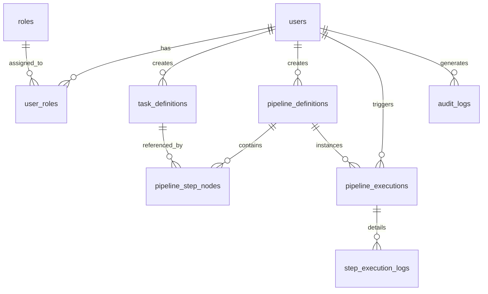
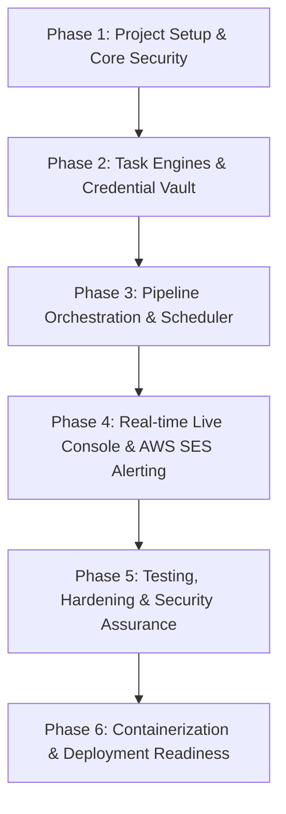

# แผนการพัฒนาระบบ Server Automation & Task Scheduling Platform (Development Plan)

อ้างอิงตามข้อกำหนดในเอกสาร [`server-task-scheduler-spec.md`](file:///c:/gravityworkspace/custos/server-task-scheduler-spec.md)

---

## 1. ภาพรวมโครงการ (Project Overview)

ระบบ **Server Automation & Task Scheduling Platform** เป็นเว็บแอปพลิเคชันระดับ Enterprise สำหรับบริหารจัดการงานเบื้องหลัง (Background Operations), งานสำรองข้อมูลอัตโนมัติ (Database & File Backup), การตัดแบ่งและส่งไฟล์ขนาดใหญ่ (File Storage & Split Transfer via FTP/SFTP), และการร้อยเรียงขั้นตอนงานแบบมีเงื่อนไข (DAG Pipeline Orchestration) ควบคุมผ่านหน้าจอ Web Dashboard แบบ Real-time พร้อมระบบความปลอดภัย RBAC และการแจ้งเตือนทางอีเมลผ่าน Amazon SES

### เป้าหมายหลักของโครงการ
1. **Reliability & Resilience:** สำรองข้อมูลและถ่ายโอนไฟล์ขนาดใหญ่ได้อย่างมีเสถียรภาพ รองรับการตัดแบ่งไฟล์ (Chunking) ตรวจสอบ Checksum (SHA-256) และ Auto-retry ราย Chunk
2. **Resource Efficiency:** สตรีมข้อมูลจาก Database Dump ตรงเข้า Compression Pipeline (Gzip/ZSTD) โดยไม่โหลดข้อมูลทั้งหมดเข้าหน่วยความจำ (Zero RAM Bloat)
3. **Security by Design:** ป้องกัน Command Injection ด้วย Argument Whitelisting, เข้ารหัส Credentials ด้วย AES-256-GCM, มีระบบ Account Lockout และ RBAC ชัดเจน
4. **Real-time Observability:** ติดตามสถานะงานและดู Live Console Log บรรทัดต่อบรรทัดผ่าน WebSocket STOMP
5. **Ease of Orchestration:** สร้างและจัดการ Workflow งานด้วย Visual DAG Builder (React Flow)

---

## 2. โครงสร้างสถาปัตยกรรมและไดเรกทอรีโปรเจกต์ (Architecture & Project Structure)

โครงสร้างโครงการเป็นแบบ Decoupled แยกส่วนระหว่าง Backend และ Frontend อย่างเป็นสัดส่วน

```
custos/
├── backend/                              # Spring Boot 3.x (Java 21)
│   ├── src/
│   │   ├── main/
│   │   │   ├── java/com/custos/
│   │   │   │   ├── config/               # Security, WebSocket, Quartz, AWS, Async
│   │   │   │   ├── modules/
│   │   │   │   │   ├── auth/             # Auth, JWT, User, Role, Audit
│   │   │   │   │   ├── vault/            # AES-256-GCM Credential Encryption
│   │   │   │   │   ├── execution/        # ProcessBuilder, Sandboxed Runner, Command Whitelist
│   │   │   │   │   ├── backup/
│   │   │   │   │   │   ├── database/     # MySQL, MariaDB, PostgreSQL Stream Dumpers
│   │   │   │   │   │   └── filesystem/   # Tar, Zstd, Zip, Exclusions
│   │   │   │   │   ├── transfer/         # Split Chunking, Checksum, FTP/FTPS, SFTP
│   │   │   │   │   ├── scheduling/       # Quartz Job & Trigger Managers
│   │   │   │   │   ├── pipeline/         # DAG Engine, Context Passing, Step Executions
│   │   │   │   │   └── notification/     # AWS SES v2 SDK, Thymeleaf Templates, Queueing
│   │   │   │   ├── shared/               # Base Entities, Exceptions, Common DTOs
│   │   │   │   └── CustosApplication.java
│   │   │   └── resources/
│   │   │       ├── db/migration/         # Flyway SQL Migration scripts (V1, V2, ...)
│   │   │       ├── templates/email/      # Thymeleaf HTML Email Templates
│   │   │       └── application.yml
│   │   └── test/                         # Unit & Integration Tests (Testcontainers)
│   ├── pom.xml (หรือ build.gradle.kts)
│   └── Dockerfile
│
├── frontend/                             # React + Vite + TypeScript
│   ├── src/
│   │   ├── assets/
│   │   ├── components/
│   │   │   ├── ui/                       # shadcn/ui components (Button, Dialog, etc.)
│   │   │   ├── layout/                   # Sidebar, Header, PageWrapper
│   │   │   ├── terminal/                 # Real-time WebSocket Live Console
│   │   │   └── flow/                     # React Flow DAG Node & Edge Components
│   │   ├── features/
│   │   │   ├── auth/                     # Login, Password Reset, Profile
│   │   │   ├── users/                    # User & Role Management Table/Forms
│   │   │   ├── tasks/                    # Task Definition Form (DB, File, Transfer)
│   │   │   ├── pipelines/                # Pipeline Builder & Execution History
│   │   │   └── dashboard/                # System Status, Stats, Recent Runs
│   │   ├── hooks/                        # useWebSocket, useAuth, useNotification
│   │   ├── services/                     # Axios/Fetch API Clients
│   │   ├── stores/                       # Global state (Zustand)
│   │   ├── types/                        # TypeScript Interfaces & Zod Schemas
│   │   └── App.tsx
│   ├── package.json
│   ├── vite.config.ts
│   └── tailwind.config.js
│
├── docker/                               # Local Dev & Testing Environment
│   ├── docker-compose.dev.yml            # Postgres, Redis, SFTP Server, LocalStack
│   └── sftp-test/                        # SFTP test container config
├── docs/                                 # API Documentation & Architecture Diagrams
└── plan.md                               # เอกสารแผนงานการพัฒนาฉบับนี้
```

---

## 3. แผนผังฐานข้อมูลและ Data Migration Plan (Database Schema)

ใช้ **Flyway Database Migration** ในการควบคุมเวอร์ชัน Schema โดยแบ่งชุดตารางเป็น 3 กลุ่มหลัก:



### สรุปตารางฐานข้อมูลหลัก
1. `users` & `roles` & `user_roles`: เก็บข้อมูลผู้ใช้, สิทธิ์ RBAC, สถานะ Active/Locked, Password Hash (BCrypt >= 12), ล็อกอินผิดสะสม (Failed Login Counter)
2. `audit_logs`: บันทึกกิจกรรมระบบ (Action, Target, User, IP, Timestamp, Changes diff)
3. `credentials_vault`: จัดเก็บ DB Connections, FTP/SFTP Credentials เข้ารหัสด้วย **AES-256-GCM**
4. `task_definitions`: แม่แบบคำสั่งงาน (Type: DB_BACKUP, FILE_BACKUP, FILE_TRANSFER, SCRIPT_EXEC) และ `config_json`
5. `pipeline_definitions`: นิยาม Workflow, Cron Expression, Missfire Strategy, สถานะ On/Off
6. `pipeline_step_nodes`: Nodes ใน DAG Workflow, ลำดับ Step, ความสัมพันธ์ `on_success_step_id`, `on_failure_step_id`
7. `pipeline_executions`: ประวัติการรันรอบนั้นๆ, สถานะ (PENDING, RUNNING, SUCCESS, FAILED, ABORTED), เวลาเริ่ม-จบ
8. `step_execution_logs`: รายละเอียดผลการรันราย Step, Logs Text, ขนาดไฟล์, Checksum, AWS SES Message ID

---

## 4. แผนการพัฒนารายระยะ (Phased Development Roadmap)

แผนงานแบ่งออกเป็น 6 ระยะ (Phases) แบบเป็นลำดับขั้น เพื่อลดความเสี่ยงและส่งมอบระบบที่พร้อมทดสอบได้อย่างต่อเนื่อง



---

### Phase 1: การวางรากฐานโปรเจกต์ ระบบความปลอดภัย และผู้ใช้งาน (Foundation & Security)
> **เป้าหมาย:** จัดเตรียมโครงสร้างโปรเจกต์, ฐานข้อมูลเริ่มต้น, และระบบ Authentication/Authorization (RBAC) ให้พร้อม 100%

#### Tasks:
- [ ] **1.1 Project Initialization & Dev Environment:**
  - สร้างโครงสร้าง Backend (Spring Boot 3.x, Java 21, Spring Data JPA, Spring Security, Validation)
  - สร้างโครงสร้าง Frontend (React, Vite, TypeScript, Tailwind CSS, shadcn/ui)
  - ตั้งค่า `docker-compose.dev.yml` (PostgreSQL 16, Redis 7, Local Mock SFTP)
- [ ] **1.2 Database & Flyway Setup:**
  - กำหนด Base Entity (id, created_at, updated_at, created_by)
  - เขียน Migration Script `V1__init_auth_schema.sql` (users, roles, user_roles, audit_logs)
  - สร้าง Seed Data: Role พื้นฐาน (`ROLE_SUPER_ADMIN`, `ROLE_ADMIN`, `ROLE_OPERATOR`, `ROLE_VIEWER`) และ Default Super Admin
- [ ] **1.3 Authentication & JWT Security:**
  - พัฒนา Spring Security 6.x Configuration (Stateless session)
  - พัฒนา Token Provider (Access Token สั้น + Refresh Token หมุนเวียนใน DB/Redis)
  - ระบบป้องกัน Brute-force: บันทึก Failed Attempts และ Account Lockout ชั่วคราวเมื่อผิดเกินเกณฑ์
  - Audit Trail Aspect/Interceptor ดักจับทุกการ Login และการเรียก Endpoint ที่สำคัญ
- [ ] **1.4 Frontend Auth & User Management:**
  - หน้า Login Screen พร้อม Validation (React Hook Form + Zod)
  - User Store (Zustand) + Axios Interceptor สำหรับ Refresh Token Rotation อัตโนมัติ
  - หน้า User & Role Management Table (TanStack Table) พร้อมฟังก์ชัน CRUD, Reset Password, Active/Suspend

---

### Phase 2: เครื่องมือประมวลผลงานและระบบจัดเก็บความลับ (Task Engines & Vault)
> **เป้าหมาย:** สร้างระบบ Executable Core ได้แก่ Sandboxed CLI, Database Dumper, File Packager, Splitter และ FTP/SFTP Transfer

#### Tasks:
- [ ] **2.1 Secure Credential Vault:**
  - พัฒนา `VaultService` สำหรับเข้ารหัส/ถอดรหัส Credentials ด้วย **AES-256-GCM** (ใช้ Master Key จาก Environment Variables)
  - ตาราง `credentials_vault` สำหรับจัดเก็บข้อมูล Connection Profile
- [ ] **2.2 Sandboxed Process Execution Engine:**
  - พัฒนา Service ห่อหุ้ม `ProcessBuilder`
  - กลไก **Strict Argument Whitelisting** และการกรอง Dangerous Characters ป้องกัน Shell/Command Injection
  - Thread Pool และ Watchdog Monitor กำหนด Execution Timeout ต่อ Process ป้องกัน Zombie Process
  - การ Capture `stdout` และ `stderr` สตรีมเข้า Ring Buffer / Log Appender
- [ ] **2.3 Database Backup Engine:**
  - Adapter สำหรับ MySQL/MariaDB (`mysqldump`) และ PostgreSQL (`pg_dump`)
  - Pipe Stream ตรงเข้า `GZIPOutputStream` หรือ Zstandard โดยไม่เขียนไฟล์ดิบลงดิสก์และไม่เปลือง RAM
  - ฟังก์ชันเลือก Backup ทั้งฐานข้อมูล หรือเลือกเฉพาะรายตาราง (White-listed tables)
  - ระบบ Retention Policy Cleanup: คำนวณและลบไฟล์สำรองเก่าตามเงื่อนไขวัน (Days-to-keep)
- [ ] **2.4 File & Directory Backup Engine:**
  - กลไกการบีบอัดไดเรกทอรีเป็น `.tar.gz`, `.tar.zst`, `.zip`
  - Glob/Regex Pattern Matcher สำหรับละเว้นไฟล์ (Exclusions: `node_modules`, `*.log`, `temp/*`)
- [ ] **2.5 File Storage & Split Transfer Engine:**
  - **Storage Pre-check:** ตรวจสอบพื้นที่ว่างปลายทาง (Disk Space Check) ก่อนเริ่มโอนย้าย
  - **Chunk Splitter:** สตรีมตัดแบ่งไฟล์ขนาดใหญ่ตามขนาดที่กำหนด (เช่น 100MB, 500MB, 1GB)
  - **Checksum Generator:** คำนวณค่า SHA-256 ของไฟล์ต้นฉบับและทุกชิ้นย่อย (Chunk)
  - **Transport Handlers:**
    - Local / Mounted NFS copy
    - FTP / FTPS Chunk Uploader (Apache Commons Net)
    - SFTP Chunk Uploader (JSch)
  - **Resilient Sequential Transfer:** ส่งทีละชิ้น ตรวจ Checksum ปลายทาง และมีกลไก Retry เฉพาะ Chunk ที่หลุดโดยไม่ต้องเริ่มใหม่

---

### Phase 3: ระบบจัดลำดับงานและตั้งเวลาอัตโนมัติ (Pipeline Orchestrator & Scheduler)
> **เป้าหมาย:** ผสานขั้นตอนงานย่อยเป็น DAG Pipeline ส่งต่อ Context ระหว่างกัน และควบคุมการรันผ่าน Quartz Scheduler

#### Tasks:
- [ ] **3.1 Quartz Scheduler Integration:**
  - กำหนดค่า Quartz ให้เก็บ State ใน PostgreSQL (Cluster-ready JDBC JobStore)
  - จัดการ JobDetail, Trigger (Daily, Weekly, Monthly, Specific Timezone, Advanced Cron)
  - Missfire Handling Policies (Fire Now, Ignore, Reschedule)
  - API ควบคุม: Trigger Now (Manual), Pause, Resume, Abort/Kill Job
- [ ] **3.2 Pipeline Orchestration Engine:**
  - Data Structure สำหรับ DAG (Directed Acyclic Graph)
  - ตรวจสอบ Cycle Dependency (Cycle Detection Algorithm)
  - **Context Passing:** ส่งต่อตัวแปรและ Artifacts (เช่น Step 1 ส่ง DB Dump Path ให้ Step 2 Split & Upload)
  - **Branching Rules:** จัดการเงื่อนไข `On Success` (ไปต่อ Step ถัดไป) และ `On Failure` (เข้า Error Handler / Fallback / Alert)
- [ ] **3.3 Frontend Visual Pipeline Builder:**
  - พัฒนาหน้าจอ Visual Workflow Builder ด้วย **React Flow (`@xyflow/react`)**
  - Custom Nodes สำหรับ Task แต่ละประเภท (DB Backup, File Backup, Split Transfer, Notification)
  - การเชื่อมต่อ Edge กำหนด Success / Failure Path
  - Form Configuration สำหรับแต่ละ Node (React Hook Form + Zod)
  - บันทึกและดึงข้อมูล Pipeline Layout (JSON Graph) ผ่าน REST API

---

### Phase 4: ระบบ Real-time Monitoring, Live Console และการแจ้งเตือน (Observability & Alerts)
> **เป้าหมาย:** ติดตามการทำงานแบบสดผ่านหน้าเว็บ และแจ้งเตือนผ่าน AWS SES อย่างแม่นยำ

#### Tasks:
- [ ] **4.1 Real-time Live Console via WebSocket (STOMP):**
  - ตั้งค่า Spring WebSocket + STOMP Broker
  - Topic Channels: `/topic/pipeline/{executionId}/logs` และ `/topic/pipeline/{executionId}/progress`
  - Frontend Live Terminal Widget (รองรับ Auto-scroll, Pause scroll, ANSI colors, Search in logs)
  - Chunk Transfer Progress Bar แสดงผล % การอัปโหลดแต่ละชิ้นแบบ Real-time
- [ ] **4.2 Execution History & Auditing:**
  - หน้ารายการ Execution History พร้อม Filter ตามวันที่, สถานะ, ชื่องาน, และผู้สั่งรัน
  - Drill-down Modal/Page ดูรายละเอียดแต่ละ Step, ขนาดไฟล์ที่ได้, Checksum, Error Details
- [ ] **4.3 AWS SES Notification Engine:**
  - เชื่อมต่อ AWS SDK for Java v2 (`software.amazon.awssdk:ses`)
  - รองรับการ Authenticate ผ่าน IAM Role หรือ Environment Credentials
  - ส่งอีเมลผ่าน Queue Worker เพื่อควบคุม Rate Limiting ตาม SES Sending Quota
  - พัฒนา HTML Responsive Email Template ด้วย **Thymeleaf**:
    - อีเมลแจ้งผลการรันสำเร็จ (Pipeline Success Summary: เวลาที่ใช้, ขนาดไฟล์, จำนวน Chunks)
    - อีเมลแจ้งเตือนข้อผิดพลาด (Pipeline Failed Alert: Step ที่ผิดพลาด, Exit code, 50 บรรทัดสุดท้ายของ Log)
    - อีเมลแจ้งเตือนระบบ (New User Welcome, Password Reset)

---

### Phase 5: การทดสอบ ความมั่นคงปลอดภัย และการปรับแต่งประสิทธิภาพ (Testing & Hardening)
> **เป้าหมาย:** ตรวจสอบความถูกต้อง ทดสอบระบบรับมือความผิดพลาด (Fault Tolerance) และความปลอดภัยรอบด้าน

#### Tasks:
- [ ] **5.1 Automated Testing:**
  - Unit Test สำหรับ Logic การคำนวณ Cron, Chunk Splitter, Checksum, Branching
  - Integration Test ด้วย **Testcontainers** (จำลอง PostgreSQL, MySQL, SFTP Server จริงใน Docker)
  - E2E Workflow Test (รัน Pipeline สำรอง DB จำลอง -> บีบอัด -> หั่นไฟล์ -> อัปโหลด SFTP จำลอง -> ส่งเมล Mock SES)
- [ ] **5.2 Security Hardening:**
  - ทดสอบเจาะระบบ Command Injection ผ่าน Task Configuration Parameters
  - ทดสอบ Brute-force Lockout และ Token Revocation
  - ตรวจสอบการเข้ารหัสของ Credentials ในฐานข้อมูล (ต้องอ่านไม่ออกหากไม่มี Master Key)
- [ ] **5.3 Resilience & Edge Case Handling:**
  - ทดสอบตัดการเชื่อมต่อเครือข่ายระหว่าง FTP Transfer แล้วตรวจสอบว่า Retry เฉพาะ Chunk ที่หลุดได้ถูกต้อง
  - ทดสอบ Disk Space Pre-check เมื่อพื้นที่ปลายทางไม่เพียงพอ ต้องหยุดงานทันทีก่อนสร้างไฟล์ขยะ
  - ทดสอบ Process Timeout Kill เมื่อเกิดคำสั่งค้าง (Hung Process)

---

### Phase 6: การจัดเตรียม Deployment และเอกสารส่งมอบ (Deployment & Documentation)
> **เป้าหมาย:** สร้าง Container Image, CI/CD Pipeline, และเอกสารคู่มือการใช้งาน

#### Tasks:
- [ ] **6.1 Containerization:**
  - Multi-stage Dockerfile สำหรับ Backend (พร้อมเครื่องมือ CLI เช่น `mysqldump`, `pg_dump`, `tar`, `gzip`, `zstd`)
  - Multi-stage Dockerfile สำหรับ Frontend (Nginx static serving)
  - Production `docker-compose.prod.yml`
- [ ] **6.2 Health & Metrics:**
  - เปิดใช้งาน Spring Boot Actuator (`/actuator/health`, `/actuator/metrics`, `/actuator/prometheus`)
- [ ] **6.3 Deliverables & Handover:**
  - เอกสาร API Specification (OpenAPI / Swagger UI)
  - คู่มือการติดตั้งและตั้งค่าระบบ (Installation & Configuration Guide)
  - คู่มือผู้ใช้งาน (Operator & Administrator Manual)

---

## 5. ตารางสรุปเวลาและเป้าหมาย (Milestones & Timeline)

| Milestone | รายละเอียดการส่งมอบ (Deliverables) | ระยะเวลาประเมิน |
| :--- | :--- | :---: |
| **M1: Core Setup & Security** | โครงสร้างโปรเจกต์, DB Schema, ระบบ Login/JWT, RBAC, User Management UI | สัปดาห์ที่ 1 - 2 |
| **M2: Engines & Transfer** | CLI Sandboxing, DB/File Backup, Chunk Splitter, Checksum, FTP/SFTP Transfer, Vault | สัปดาห์ที่ 3 - 4 |
| **M3: Orchestration & Scheduler** | Quartz Engine, Context Passing, DAG Builder (React Flow), Task Forms | สัปดาห์ที่ 5 - 6 |
| **M4: Live Console & AWS SES** | WebSocket STOMP Live Terminal, Execution History Table, Email Templates & SES v2 | สัปดาห์ที่ 7 |
| **M5: Testing & Hardening** | Integration Test (Testcontainers), Resilience / Retry Testing, Security Audit | สัปดาห์ที่ 8 |
| **M6: Deployment Readiness** | Docker Production Images, CI/CD Pipeline, Actuator Metrics, เอกสารคู่มือ | สัปดาห์ที่ 9 |

---

## 6. ตารางวิเคราะห์ความเสี่ยงและแนวทางแก้ไข (Risk Management Matrix)

| ความเสี่ยง (Risk) | ผลกระทบ | โอกาสเกิด | มาตรการป้องกันและแก้ไข (Mitigation Strategy) |
| :--- | :---: | :---: | :--- |
| **1. Command Injection** ผ่านชื่อฐานข้อมูลหรือพารามิเตอร์ของ Shell | ร้ายแรง | ปานกลาง | บังคับใช้ **Strict Argument Whitelisting** ผ่าน Java `ProcessBuilder` โดยไม่ส่งต่อสตริงเข้า Shell ตรงๆ (ห้ามใช้ `sh -c` หรือ `cmd /c` กับ input ที่ไม่ได้ตรวจสอบ) |
| **2. หน่วยความจำเต็ม (OOM)** ขณะสำรองฐานข้อมูลขนาดใหญ่ | สูง | สูง | สตรีม Output ตรงจาก CLI (`mysqldump` / `pg_dump`) สู่ Compression Stream โดยตรง ไม่โหลดเข้า Java Heap Memory |
| **3. Network หลุดระหว่างส่งไฟล์ขนาดใหญ่** | ปานกลาง | สูง | ใช้ฟังก์ชัน **Chunk Splitter** แบ่งไฟล์เป็นชิ้นย่อย (100MB-1GB) พร้อม Checksum SHA-256 หากหลุดจะ Retry เฉพาะชิ้นนั้น ไม่ต้องเริ่มส่งใหม่ทั้งหมด |
| **4. เกินโควตาการส่งอีเมล (AWS SES Rate Limit)** | ปานกลาง | ปานกลาง | นำระบบ In-memory/Redis Queue มาคั่นระหว่างการยิง SES API พร้อมตั้ง Rate Limiter ให้สอดคล้องกับ TPS ของบัญชี AWS |
| **5. ดิสก์ปลายทางเต็มระหว่างสำรองข้อมูล** | สูง | ปานกลาง | ทำ **Storage Pre-check** ตรวจสอบพื้นที่ว่างปลายทางเทียบกับขนาดประเมินก่อนเริ่มงาน หากไม่พอให้แจ้งเตือนทันที |
| **6. คีย์ Credentials รั่วไหลจากการเข้าถึงฐานข้อมูล** | ร้ายแรง | ต่ำ | เข้ารหัส Credentials ด้วย **AES-256-GCM** ในระดับ Data Layer โดย Master Key จัดเก็บแยกใน Environment Variable เท่านั้น |

---

## 7. เกณฑ์การยอมรับและการตรวจรับงาน (Acceptance Criteria / Definition of Done)

1. **Authentication & Authorization:**
   - [ ] รองรับการ Login และ Refresh Token Rotation ได้อย่างปลอดภัย
   - [ ] บล็อกบัญชีอัตโนมัติเมื่อใส่รหัสผ่านผิดเกิน 5 ครั้งติดต่อกัน
   - [ ] ผู้ใช้แต่ละ Role (`SUPER_ADMIN`, `ADMIN`, `OPERATOR`, `VIEWER`) ถูกจำกัดสิทธิ์ใน API และ UI อย่างถูกต้อง
2. **Backup & Transfer:**
   - [ ] สามารถสำรองข้อมูล MySQL และ PostgreSQL ออกมาเป็น `.sql.gz` หรือ `.sql.zst` ได้โดย RAM ของ Java Application ไม่พุ่งสูง
   - [ ] สามารถหั่นไฟล์สำรองขนาดเกินเกณฑ์ที่กำหนดออกเป็นชิ้นย่อย (Parts) พร้อมคำนวณและตรวจสอบ SHA-256 ได้ถูกต้อง
   - [ ] สามารถส่งไฟล์ผ่าน SFTP/FTP สำเร็จ และสามารถจำลองการตัดเน็ตแล้วระบบสามารถส่งต่อเฉพาะ Chunk ที่ค้างได้
3. **Pipeline & Scheduling:**
   - [ ] สามารถสร้าง DAG Pipeline ผ่านหน้าจอ React Flow และบันทึกเข้าฐานข้อมูลได้
   - [ ] Pipeline สามารถทำงานตามเงื่อนไข On Success และ On Failure ได้ถูกต้อง
   - [ ] สามารถตั้งเวลาผ่าน Cron Expression และสั่งรันทันที (Manual Trigger) หรือระงับการทำงาน (Pause/Resume) ได้
4. **Real-time Observability & Notification:**
   - [ ] หน้าเว็บสามารถดู Live Terminal แสดงผล Log ทีละบรรทัดระหว่างรันได้โดยไม่กระตุก
   - [ ] มีอีเมลแจ้งเตือนผ่าน AWS SES ส่งถึงผู้รับเมื่อรันเสร็จสิ้น หรือแจ้งเตือนเมื่อเกิด Error พร้อมแนบ 50 บรรทัดสุดท้ายของ Log
